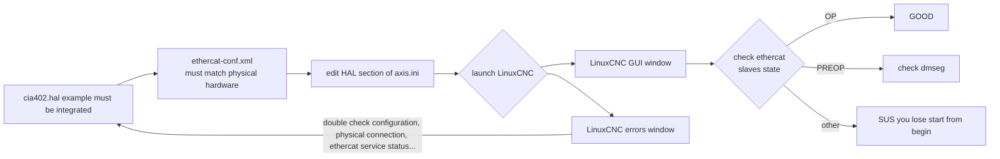
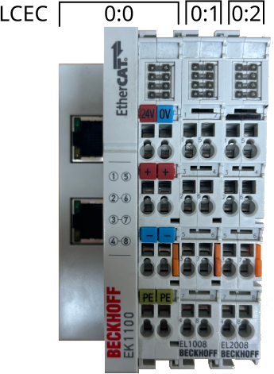
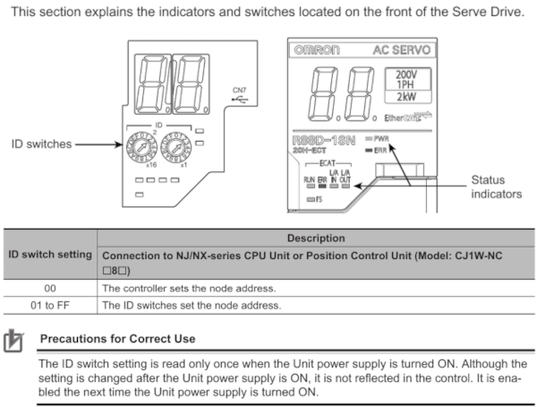

# Commissioning LinuxCNC

## Summary

- [Commissioning LinuxCNC](#commissioning-linuxcnc)
  - [Summary](#summary)
  - [Hardware overview](#hardware-overview)
  - [Commissioning](#commissioning)
    - [Machine-specific configuration process flowchart](#machine-specific-configuration-process-flowchart)
    - [cia402.hal](#cia402hal)
    - [ethercat-conf.xml](#ethercat-confxml)
      - [Adding BECKHOFF modules](#adding-beckhoff-modules)
      - [Adding OMRON R88D-1SN01H-ECT servo drive](#adding-omron-r88d-1sn01h-ect-servo-drive)
    - [axis.ini](#axisini)

## Hardware overview

- Computer
- BECKHOFF EK1100
  - BECKHOFF EL1008 (DI Module)
  - BECKHOFF EL2008 (DO Module)
- OMRON R88D-1SN04H-ECT (servo drive)
- OMRON R88M-1M40030H-S2 (servo motor)

## Commissioning

To define your machine-specific configuration, some files are required.
These files are created when using LinuxCNC configuration selector and can be found in the example path tree below.

```tree
/
└── home/
    └── user-name/
        └── linuxcnc/
            ├── configs/
            │   └── my-machine/
            │       ├── axis.ini
            │       ├── axis.hal
            │       ├── ...
            │       ├── ...
            │       └── README
            └── nc_files
```

### Machine-specific configuration process flowchart



### cia402.hal

The R88D-1SN01H-ECT from OMRON is a CiA402-compliant servo drive.
An example config is found here: <https://github.com/dbraun1981/hal-cia402>

```tree
/
└── home/
    └── user-name/
        └── linuxcnc/
            ├── configs/
            │   └── my-machine/
            │       ├── axis.ini
            │       ├── axis.hal
            │       ├── cia402.hal
            │       ├── ethercat-conf.xml
            │       └── README
            └── nc_files
```

> [!NOTE]
> CiA402 is a standard for servo drives, stepper drives, VFDs, and similar motion controllers. It is part of the CanOPEN Industry Association, and can be implemented on top of EtherCAT and other common fieldbusses.

### ethercat-conf.xml

A .xml file is required for setup LinuxCNC. You will need to make your .xml **match** what you have for the physical hardware (see command: $ ethercat slaves).

#### Adding BECKHOFF modules

> [!TIP]
> Add one module at a time and check if it’s working correctly.

In this case the hardware configuration is the following:



So the ethercat-conf.xml file looks like this:

```xml
<!--ethercat-conf.xml-->
<masters>
  <master idx="0" appTimePeriod="1000000" refClockSyncCycles="-1">
    <slave idx="0" type="EK1100"/>
    <slave idx="1" type="EL1008"/>
    <slave idx="2" type="EL2008"/>
  </master>
</masters>
```

The command below provides additional information that may be helpful like Vendor Id and Product Code when using more complex hardware:

```sh
ethercat slaves -v

# [terminal output]
=== Master 0, Slave 0 ===
Device: Main
State: PREOP
Flag: +
Identity:
  Vendor Id:       0x00000002
  Product code:    0x044c2c52
...
# [terminal output]
```

Ethercat slaves status must be in OP state when LinuxCNC application is open.

```sh
ethercat slaves

# [terminal output]
0  0:0  OP  +  EK1100 EtherCAT Coupler (2A E-Bus)
1  0:1  OP  +  EL1008 8K. Dig. Eingang 24V, 3ms
2  0:2  OP  +  EL2008 8K. Dig. Ausgang 24V, 0.5A
# [terminal output]
```

#### Adding OMRON R88D-1SN01H-ECT servo drive

The node address of the servo drive must be setted using ID switches.



```xml
<!--ethercat-conf.xml-->
<masters>
    <master idx="0" appTimePeriod="1000000" refClockSyncCycles="-1">
        <slave idx="0" type="EK1100"/>
        <slave idx="1" type="EL1008"/>
        <slave idx="2" type="EL2008"/>
        <slave idx="3" type="generic" vid="0x00000083" pid="0x000000b0" name="X" configPdos="true">
            <dcConf assignActivate="300" sync0Cycle="*1" sync0Shift="0"/>
            <watchdog divider="2498" intervals="1000"/>


<!--...-->
```

### axis.ini

Add on [HAL] section:

```sh
[HAL]

HALFILE = cia402.hal
```
