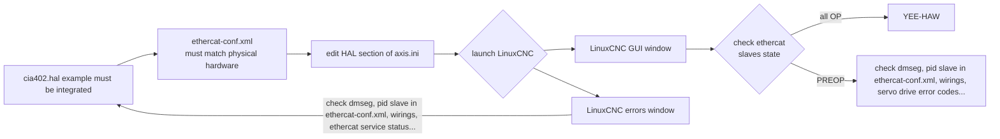
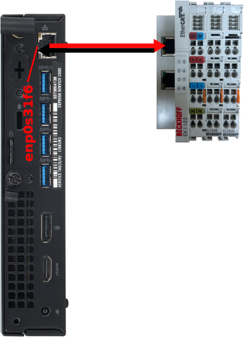
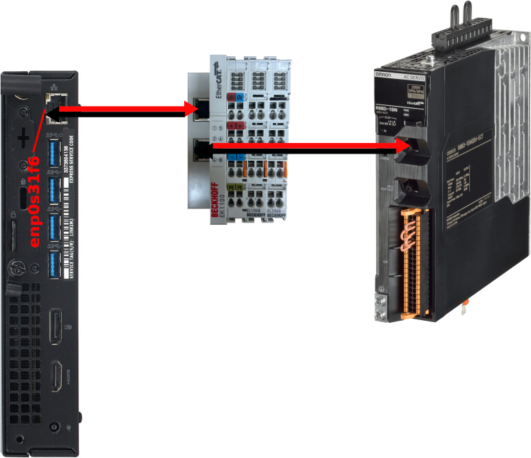
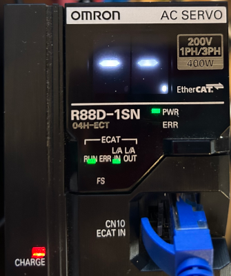

# Commissioning LinuxCNC

## Summary

- [Commissioning LinuxCNC](#commissioning-linuxcnc)
  - [Summary](#summary)
  - [Hardware overview](#hardware-overview)
  - [Useful hyperlinks](#useful-hyperlinks)
  - [Commissioning](#commissioning)
    - [Machine-specific configuration process flowchart](#machine-specific-configuration-process-flowchart)
    - [cia402.hal](#cia402hal)
    - [axis.ini](#axisini)
    - [ethercat-conf.xml](#ethercat-confxml)
      - [Adding BECKHOFF modules](#adding-beckhoff-modules)
      - [Adding OMRON R88D-1SN04H-ECT servo drive](#adding-omron-r88d-1sn04h-ect-servo-drive)
  - [Test request](#test-request)
  - [Next step](#next-step)

## Hardware overview

- Computer
- BECKHOFF EK1100
  - BECKHOFF EL1008 (DI Module)
  - BECKHOFF EL2008 (DO Module)
- OMRON R88D-1SN04H-ECT (servo drive)
- OMRON R88M-1M40030H-S2 (servo motor)

## Useful hyperlinks

Devices supported by linuxcnc-ethercat: <https://github.com/linuxcnc-ethercat/linuxcnc-ethercat/blob/master/documentation/DEVICES.md>

EtherCAT ESI data: <https://linuxcnc-ethercat.github.io/esi-data/devices/>

## Commissioning

To define your machine-specific configuration, some files are required.
These files are also created when using LinuxCNC configuration selector and can be found in the example path tree below.

```tree
/
└── home/
    └── user-name/
        └── linuxcnc/
            ├── configs/
            │   └── my-machine/
            │       ├── axis.ini
            │       ├── axis.hal
            │       ├── ...
            │       ├── ...
            │       └── README
            └── nc_files
```

### Machine-specific configuration process flowchart



### cia402.hal

The R88D-1SN04H-ECT from OMRON is a CiA402-compliant servo drive.
An example config can be found here: <https://github.com/dbraun1981/hal-cia402>

```tree
/
└── home/
    └── user-name/
        └── linuxcnc/
            ├── configs/
            │   └── my-machine/
            │       ├── axis.ini
            │       ├── axis.hal
            │       ├── cia402.hal
            │       ├── ethercat-conf.xml
            │       └── README
            └── nc_files
```

> [!NOTE]
> CiA402 is a standard for servo drives, stepper drives, VFDs, and similar motion controllers. It is part of the CanOPEN Industry Association, and can be implemented on top of EtherCAT and other common fieldbusses.

### axis.ini

In the file axis.ini add in the [HAL] section the following:

```sh
HALFILE = cia402.hal
```

Complete file: [axis.ini](config/beckhoff+omron/axis.ini)

### ethercat-conf.xml

A .xml file is required for setup LinuxCNC. You will need to make your .xml **match** what you have for the physical hardware. You can use below command for helping you in the process.

```sh
lcec_configgen
```

Output of the command: [lcec_configgen-output](config/beckhoff/lcec_configgen-output.xml)

The command below provides additional information that may be helpful like Vendor Id and Product Code when using more complex hardware:

```sh
ethercat slaves -v

# [terminal output]
=== Master 0, Slave 0 ===
Device: Main
State: PREOP
Flag: +
Identity:
  Vendor Id:       0x00000002
  Product code:    0x044c2c52
...
# [terminal output]
```

> [!TIP]
> Add one module at a time and check if it’s working correctly.

For more information about tag used in the file, see: <https://github.com/linuxcnc-ethercat/linuxcnc-ethercat/blob/master/documentation/configuration-reference.md>

#### Adding BECKHOFF modules

Hardware overview



The ethercat-conf.xml file looks like this:

```xml
<!--ethercat-conf.xml-->
<masters>
  <master idx="0" appTimePeriod="1000000" refClockSyncCycles="-1">
    <slave idx="0" type="EK1100"/>
    <slave idx="1" type="EL1008"/>
    <slave idx="2" type="EL2008"/>
  </master>
</masters>
```

Ethercat slaves status must be in OP state when LinuxCNC application is open.

```sh
ethercat slaves

# [terminal output]
0  0:0  OP  +  EK1100 EtherCAT Coupler (2A E-Bus)
1  0:1  OP  +  EL1008 8K. Dig. Eingang 24V, 3ms
2  0:2  OP  +  EL2008 8K. Dig. Ausgang 24V, 0.5A
# [terminal output]
```

#### Adding OMRON R88D-1SN04H-ECT servo drive

Hardware overview.



A more detailed configuration is required when using more complex hardware.

> [!TIP]
> Use lcec_configgen command for helping you in the process. Output of the command: [lcec_configgen-output](config/beckhoff+omron/lcec_configgen-output.xml)

Below an extract of [ethercat-conf.xml](config/beckhoff+omron/ethercat-conf.xml) that includes R88D-1SN04H-ECT as slave 3.

```xml
<!--ethercat-conf.xml-->
<masters>
    <master idx="0" appTimePeriod="1000000" refClockSyncCycles="-1">
        <slave idx="0" type="EK1100"/>
        <slave idx="1" type="EL1008"/>
        <slave idx="2" type="EL2008"/>
        <slave idx="3" type="generic" vid="0x00000083" pid="0x000000b0" name="X" configPdos="true">
            <dcConf assignActivate="300" sync0Cycle="*1" sync0Shift="0"/>
            <watchdog divider="2498" intervals="1000"/>
<!--...-->
```

Deep dive into: [ethercat-config](deep-dive-ethercat-config.md)

Ethercat slaves status must be in OP state when LinuxCNC application is open.

```sh
ethercat slaves

# [terminal output]
0  0:0  OP  +  EK1100 EtherCAT-Koppler (2A E-Bus)
1  0:1  OP  +  EL1008 8K. Dig. Eingang 24V, 3ms
2  0:2  OP  +  EL2002 2K. Dig. Ausgang 24V, 0.5A
3  0:3  OP  +  R88D-1SN04H-ECT 200V/400W ServoDrive
# [terminal output]
```



If the Servo Drive detects an abnormality, it outputs an error (/ERR), turns OFF the power drive circuit, and displays the error number (main and sub) on the front panel. Check:  1S-series with Built-in EtherCAT Communications User’s Manual (I586) section 12 for error description.

See: [omron-1sn-troubleshoot](omron-1sn-troubleshoot.md) for error codes and troubleshooting.

## Test request

Launch linuxcnc with command:

```sh
linuxcnc
```

Check available pdos on slave 3.

```sh
ethercat pdos -p 3
```

Read value of pdo 0x603f of slave 3

```sh
ethercat upload -p 3 0x603f 0 --type uint16
```

## Next step

Next step: [customizing-linuxcnc](customizing-linuxcnc.md)