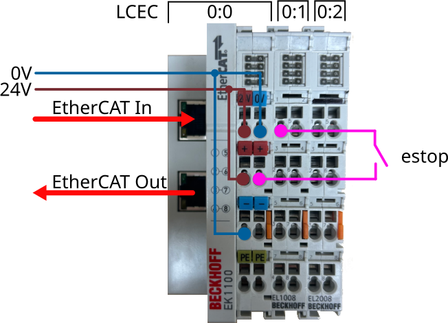
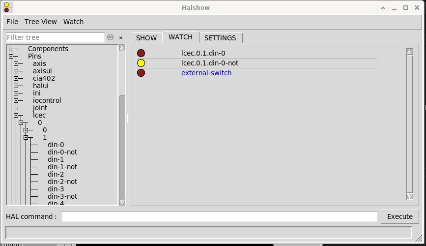
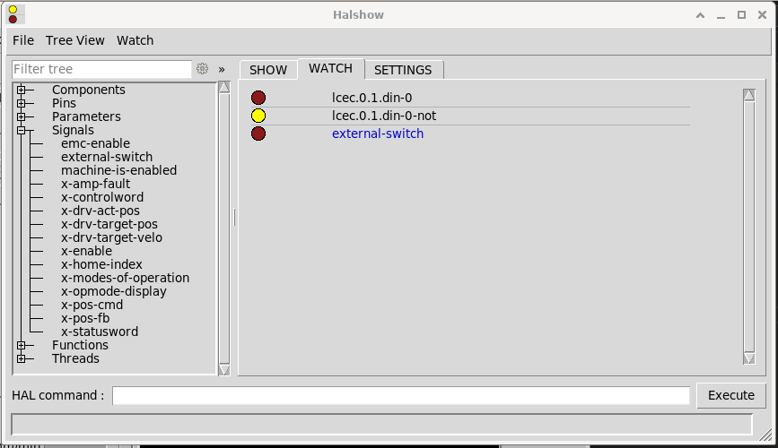

# Customizing linuxcnc

```tree
/
└── home/
    └── user-name/
        └── linuxcnc/
            ├── configs/
            │   └── my-machine/
            │       ├── axis.ini
            │       ├── axis.hal
            │       ├── custom-cooling.xml
            │       └── README
            └── nc_files
```

## Add a physical external switch

From physical side connect it to the input module.



From linuxcnc side a .hal file must be modified. In this case we use a file named cia402.hal.
Using the command net we create a connection between a signal and one or more pins.

```sh
#   signal    source            destination          destination
net estop lcec.0.1.din-0
```




