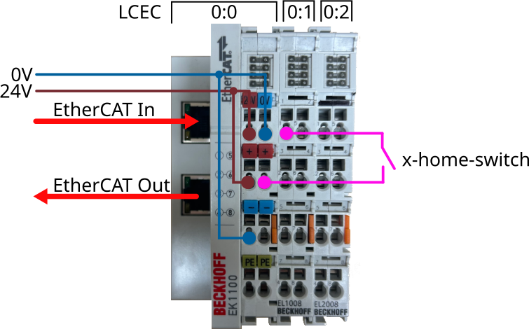

# Customizing linuxcnc

```tree
/
└── home/
    └── user-name/
        └── linuxcnc/
            ├── configs/
            │   └── my-machine/
            │       ├── axis.ini
            │       ├── axis.hal
            │       ├── custom-cooling.xml
            │       └── README
            └── nc_files
```

## Add external switch for homing X axis

From physical side connect it to the input module.



cia402.hal file must me modified as follows.

```sh
#   signal    source            destination          destination
net x-home-switch <= lcec.0.1.din-0
net x-home-switch => joint.0.home-sw-in
```

Using the command **net** we create a connection between asignal and one or more pins.
To check status of pin: Machine > Show Hal Configuration

Then navigate through the tree menu: Pins > lcec > 0 > 1


