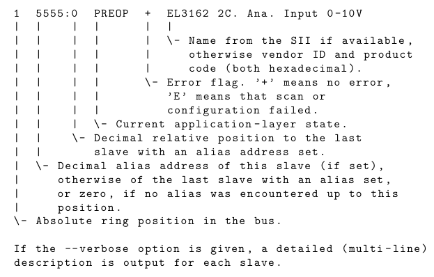
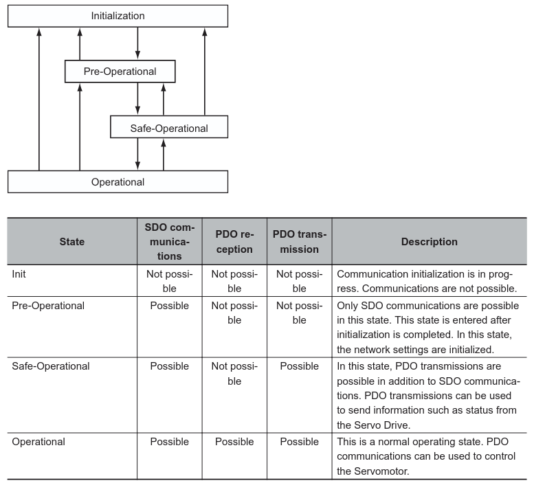
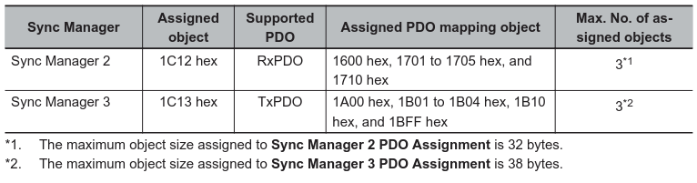
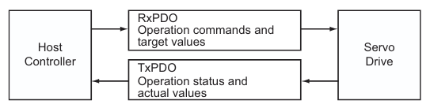

# EtherCAT basics


## Documentation

[ethercat-doc](docs/ethercat_doc.pdf)

## Slaves on the bus 🚌

```sh
ethercat slaves -v
```



*Explanation of output of ethercat slaves command*.

Application-layer states:

- INIT
- PREOP, Pre - operational
- BOOT
- SAFEOP, Safe - operational
- OP, Operational



## Sync Manager

A Sync Manager channel consists of several PDOs. The Sync Manager PDO Assignment objects describe relationships between these PDOs and the Sync Manager.



## Process Data Objects (PDOs)

The process data objects (PDOs) are used for real-time data transfer during cyclic communications.
PDOs can be RxPDOs, which receive data from the controller, or TxPDOs, which send status from the
Servo Drive to the host controller.



1S-series Servo Drives with Built-in EtherCAT Communications use Sync Manager 2 to 3 PDO Assignment.

You can assign PDO mapping objects to each Sync Manager as shown in the following table.

Objects are mapped in the order of subindex setting 01 hex, 02 hex, and 03 hex.
These objects can be changed only when the EtherCAT communications state is Pre-Operational.
Since the mapping you changed is not saved in non-volatile memory, set the EtherCAT master so that
the settings can be configured each time you turn ON the power supply in order to use the mapping
other than the default setting.

## Hyperlinks

<https://etherlab.org/en_GB/ethercat>
