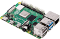

# Installing linuxcnc

## Summary

- [Installing linuxcnc](#installing-linuxcnc)
  - [Summary](#summary)
  - [Installation on Raspberry Pi 4](#installation-on-raspberry-pi-4)
    - [Internet connection](#internet-connection)
  - [Installation on a PC](#installation-on-a-pc)
    - [Update](#update)
  - [Next step](#next-step)

## Installation on Raspberry Pi 4



Download: <https://www.linuxcnc.org/iso/rpi-4-debian-bookworm-6.12.11-arm64-ext4-2025-01-27-0404.img.xz>

Install on a microSD card using Raspberry Pi Imager

User: cnc

Password: cnc

### Internet connection

```sh
sudo menu-config
```

Enter > N) Networking.

Edit: /etc/wpa_supllicant/wpa_supllicant.conf

[wpa_supplicant.conf](/installing-rp/wpa_supplicant.conf)

Enter > 5) Edit wpa supplicant.

Edit: /etc/network/interfaces

[interfaces](/installing-rp/interfaces.conf)

Enter > 6) Edit interface.

## Installation on a PC


Download: <http://linuxcnc.org/downloads/>

Installation: <http://linuxcnc.org/docs/stable/html/getting-started/getting-linuxcnc.html> 

Create bootable USB stick using Rufus or balenaEtcher.

Insert USB and boot from it following instructions.

> [!IMPORTANT]
> **MANDATORY** The PC **MUST BE CONNECTED TO INTERNET**.

### Update

Log in, open terminal and paste:

```sh
sudo apt update && sudo apt upgrade && sudo reboot
```

## Next step

Next step: [setup-ethercat](setup-ethercat.md)
