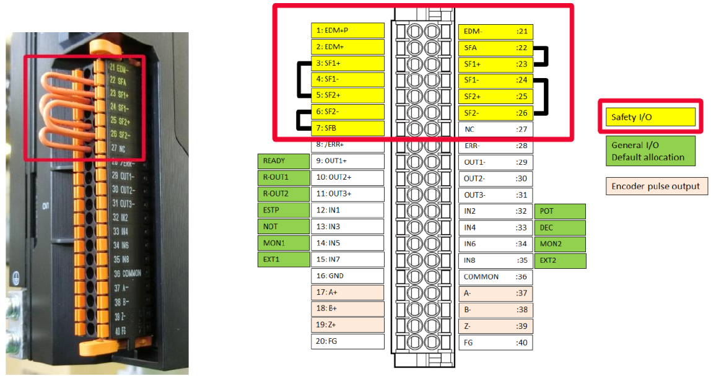
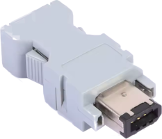

# OMRON troubleshooting

- [OMRON troubleshooting](#omron-troubleshooting)
  - [Node address](#node-address)
  - [Wiring](#wiring)
    - [CN1 control IO connector](#cn1-control-io-connector)
    - [CN2 encoder connector](#cn2-encoder-connector)
  - [Error codes](#error-codes)

## Node address

The node address of the servo drive must be setted using ID switches. In this specific case: 0 and 3.

## Wiring

Please refer to original manuals for installation and wiring instructions.

### CN1 control IO connector

For inihibition of STO function bypass with jumpers.

### CN2 encoder connector

For the encoder connector is needed a 6 pin Firewire IEEE 1394 male plug.

| **Pin No.** | **Symbol** | **Name**                        |
|-------------|------------|---------------------------------|
| 1           | E5V        | Encoder power supply voltage    |
| 2           | E0V        | Encoder power supply GND        |
| 3           | NC         | Not used                        |
| 4           | NC         | Not used                        |
| 5           | PS+        | Encoder + phase S I/O           |
| 6           | PS-        | Encoder - phase S I/O           |
| Shell       | FG         | Frame ground                    |

## Error codes

For a complete list see: [i586_1s_series_users_manual_en](docs/i586_1s_series_users_manual_en.pdf)

| **Error No** |             | **Error Name**     | **Possible resolution**|
|:-------------:|:-----------:|:------------------:|:------------------:|
| **Main**      | **Sub**     |                   | |
| 83            | 03          | Communications Synchronization Error | (A) Connect EtherCAT cable (B) replace it |
| 83            | 04          | Synchronization Error| - |
| 83            | 05          | Sync Manager WDT Error | (A) Connect EtherCAT cable (B) replace it (C) check for mismatch configuration between reality and what expected from linuxcnc|
| 21            | 00          | Encoder Communications Disconnection Error | (A) Connect encoder cable on CN2 connector (B) check correct wiring connection, see connector: [CN2](#cn2-encoder-connector) (C) turn OFF->ON 24V drive power (D) replace it |
| 62            | 00          | Control Right Release Error | |
| 61            | 00          | NOT DOCUMENTED | Connect main power |
| St            | -          | STO activated | (A) Bypass, see connector: [CN1](#cn1-control-io-connector) |
