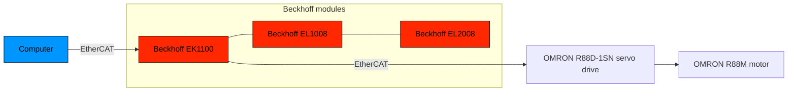

# LinuxCNC x EtherCAT (Beckhoff EK1100)

## About this repository

This repo provides a collection of LinuxCNC commands, configuration files, resources collected through hands-on use with LinuxCNC using the **EtherCAT** protocol, **BECKHOFF** modules and **OMRON 1SN** servo drive.

LinuxCNC version used is: 2.9.6

## Summary

- [LinuxCNC x EtherCAT (Beckhoff EK1100)](#linuxcnc-x-ethercat-beckhoff-ek1100)
  - [About this repository](#about-this-repository)
  - [Summary](#summary)
  - [Hardware overview](#hardware-overview)
  - [Phase 1: installing LinuxCNC](#phase-1-installing-linuxcnc)
  - [Phase 2: setup EtherCAT master](#phase-2-setup-ethercat-master)
  - [Phase 3: commissioning LinuxCNC slaves (BECKHOFF and OMRON)](#phase-3-commissioning-linuxcnc-slaves-beckhoff-and-omron)
  - [Phase 4: customizing LinuxCNC](#phase-4-customizing-linuxcnc)

## Hardware overview

## Phase 1: installing LinuxCNC

> [!NOTE]
> To operate machinery LinuxCNC requires a special kernel with real-time extensions.

See: [installing-linuxcnc](installing-linuxcnc.md)

## Phase 2: setup EtherCAT master

See: [setup-ethercat](setup-ethercat.md)

## Phase 3: commissioning LinuxCNC slaves (BECKHOFF and OMRON)

See: [commissioning-linuxcnc](commissioning-linuxcnc.md)

## Phase 4: customizing LinuxCNC

See: [customizing-linuxcnc](customizing-linuxcnc.md)
