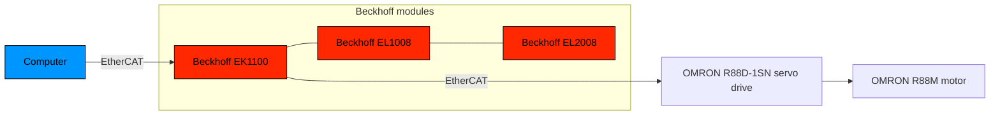

# LinuxCNC x EtherCAT (Beckhoff EK1100)

## Summary

- [LinuxCNC x EtherCAT (Beckhoff EK1100)](#linuxcnc-x-ethercat-beckhoff-ek1100)
  - [Summary](#summary)
  - [Hardware overview](#hardware-overview)
  - [Phase 1: installing LinuxCNC](#phase-1-installing-linuxcnc)
  - [Phase 2: setup EtherCAT](#phase-2-setup-ethercat)
  - [Phase 3: commissioning LinuxCNC](#phase-3-commissioning-linuxcnc)
  - [Phase 4: customizing LinuxCNC](#phase-4-customizing-linuxcnc)

## Hardware overview

## Phase 1: installing LinuxCNC

> [!NOTE]
> To operate machinery LinuxCNC requires a special kernel with real-time extensions.

See: [installing-linuxcnc](installing-linuxcnc.md)

## Phase 2: setup EtherCAT

See: [setup-ethercat](setup-ethercat.md)

## Phase 3: commissioning LinuxCNC

See: [commissioning-linuxcnc](commissioning-linuxcnc.md)

## Phase 4: customizing LinuxCNC

See: [customizing-linuxcnc](customizing-linuxcnc.md)
