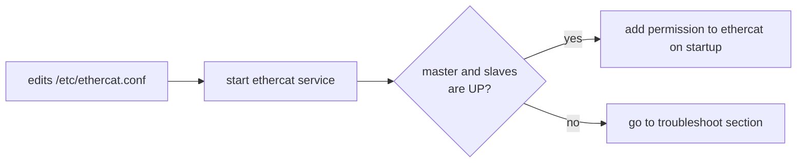
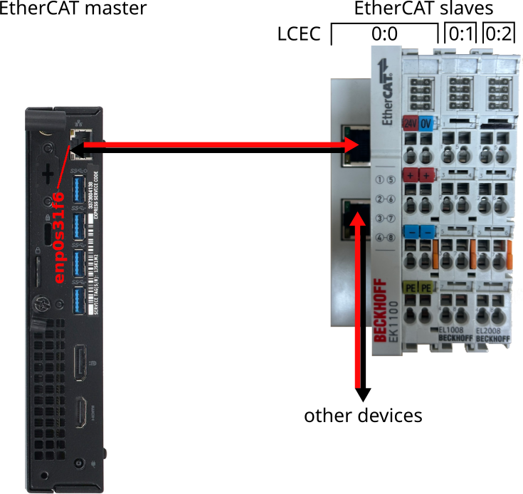
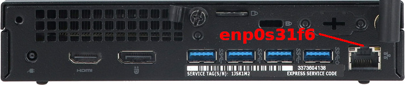

# Setup EtherCAT master

## Summary

- [Setup EtherCAT master](#setup-ethercat-master)
  - [Summary](#summary)
  - [Installation](#installation)
  - [Setup](#setup)
    - [Setup process](#setup-process)
    - [Hardware connection](#hardware-connection)
    - [Service configuration](#service-configuration)
    - [Almost there](#almost-there)
  - [Next step](#next-step)
  - [Troubleshoot](#troubleshoot)
    - [Check dmesg related to ethercat](#check-dmesg-related-to-ethercat)
    - [Check all dmesg](#check-all-dmesg)
    - [Check journalctl logs related to ethercat](#check-journalctl-logs-related-to-ethercat)
    - [Check all journalctl logs](#check-all-journalctl-logs)
    - [Increase debug level](#increase-debug-level)
  - [Hyperlinks](#hyperlinks)

## Installation

Original forum post: <https://forum.linuxcnc.org/ethercat/45336-ethercat-installation-from-repositories-how-to-step-by-step>

```sh
sudo apt update
sudo apt install linuxcnc-ethercat
```

**If that fails, try this complete command:**

```sh
sudo apt install ethercat-master libethercat-dev linuxcnc-ethercat
```

## Setup


### Setup process



### Hardware connection



### Service configuration

Edits your /etc/ethercat.conf as follows:

```sh
# xx:aa:yy:zz:bb:cc must be replaced with the one found using ip -c a command.
MASTER0_DEVICE="xx:aa:yy:zz:bb:cc"
DEVICE_MODULES="generic"
```

Where "xx:aa:yy:zz:bb:cc" is the MAC address of the NIC to be used for ethercat and must be replaced with the one found using: ip -c a

```sh
ip -c a

# [terminal output]
...
2: enp0s31f6: <NO-CARRIE...
    link/ether xx:aa:yy:zz:bb:cc brd ....
...
# [terminal output]

sudo geany /etc/ethercat.conf
```



Start ethercat service.

```sh
sudo systemctl enable ethercat.service
sudo systemctl start ethercat.service
sudo systemctl status ethercat.service
sudo chmod 666 /dev/EtherCAT0
```

Check ethercat master status.
If all is working correctly you should see how many slaves are connected and link status is UP (next section: [almost there](#almost-there)).

```sh
ethercat master

# Master is communicating (link is UP with 3 slaves)
# [terminal output]
Master0
  Phase: Idle
  Active: No
  Slaves: 3
  Ethernet devices:
    Main: xx:aa:yy:zz:bb:cc (attached)
    Link: UP
...
# [terminal output]
 
# Master is not communicating (link is DOWN with 0 slaves)
# [terminal output]
Master0
  Phase: Idle
  Active: No
  Slaves: 0
  Ethernet devices:
    Main: xx:aa:yy:zz:bb:cc (attached)
    Link: DOWN
...
# [terminal output]
```

Check ethercat slaves status and show the application-layer states of the slaves.
If ethercat slaves command is sent during boot up operation you will see INIT as status.

```sh
ethercat slaves

# [terminal output]
0  0:0  INIT  +  EK1100 EtherCAT Coupler (2A E-Bus)
1  0:1  PREOP  +  EL1008 8K. Dig. Eingang 24V, 3ms
2  0:2  PREOP  +  EL2008 8K. Dig. Ausgang 24V, 0.5A
# [terminal output]
```

See [ethercat-basics](ethercat-basics.md) for brief explanation.


### Almost there

To ensure the ethercat port has permissions on startup. Create a udev rule as follow:

```sh
sudo geany /etc/udev/rules.d/99-ethercat.rules  
```

Add:

```sh
KERNEL=="EtherCAT[0-9]", MODE="0777"
```

```sh
sudo udevadm control --reload-rules
sudo reboot
```

## Next step

Next step: [commissioning-linuxcnc](commissioning-linuxcnc.md)

## Troubleshoot


Using below command for errors.

### Check dmesg related to ethercat

```sh
sudo dmesg | grep -i ethercat

# [terminal output]

# [terminal output]
```

### Check all dmesg

For a complete list use the following command:

```sh
sudo dmesg -wH

# [terminal output]
[  +0.000015] EtherCAT 0: Starting EtherCAT-IDLE thread.
[  +0.000025] EtherCAT DEBUG 0: Idle thread running with send interval = 4000 us, max data size=45000
[  +0.000006] EtherCAT DEBUG 0: UNMATCHED datagram:
[  +0.000001] EtherCAT DEBUG: 0C 20 00 00 00 00 32 80 00 00 00 00 04 00 C0 B4 
[  +0.000008] EtherCAT 0: Releasing master...
[  +0.000000] EtherCAT DEBUG: 00 
[  +0.000001] EtherCAT DEBUG 0: OPERATION -> IDLE.
[  +0.000001] 00 
[  +0.000000] EtherCAT 0: Released.
[  +0.000000] 00 00 00 00 00 00 08 00 00 00 00 00 00 83 
[  +0.000006] EtherCAT DEBUG: FF 38 06 C1 B4 00 00 00 00 08 00 00 00 00 00 00 
[  +0.000007] EtherCAT DEBUG: 00 00 00 00 03 00 00 18 30 F8 FF FF 06 00 
[  +0.000007] EtherCAT ERROR 0-1: Failed to receive AL state datagram: Datagram initialized.
[  +0.004154] EtherCAT 0: Slave states on main device: SAFEOP, OP + ERROR.
[  +0.008014] EtherCAT DEBUG 0-0: Changing state from OP to PREOP (forced).
[  +0.000004] EtherCAT DEBUG 0-0: Configuring...
[  +0.000569] EtherCAT DEBUG 0-0: Now in INIT.
[  +0.000001] EtherCAT DEBUG 0-0: Clearing FMMU configurations...
[  +0.000262] EtherCAT DEBUG 0-0: Clearing sync manager configurations...
[  +0.000261] EtherCAT DEBUG 0-0: Clearing DC assignment...
[  +0.000269] EtherCAT DEBUG 0-0: Slave does not support mailbox communication.
[  +0.000003] EtherCAT DEBUG 0-0: Assigning SII access to PDI.
[  +0.000786] EtherCAT DEBUG 0-0: Now in PREOP.
# [terminal output]
```

### Check journalctl logs related to ethercat

```sh
sudo journalctl -f | grep -i ethercat

# [terminal output]

# [terminal output]
```

### Check all journalctl logs

For a complete list use the following command:

```sh
sudo journalctl -f

# [terminal output]
Aug 27 20:26:14 linuxcnc kernel: EtherCAT: Requesting master 0...
Aug 27 20:26:14 linuxcnc kernel: EtherCAT: Successfully requested master 0.
Aug 27 20:26:14 linuxcnc kernel: EtherCAT 0: Domain0: Logical address 0x00000000, 50 byte, expected working counter 6.
Aug 27 20:26:14 linuxcnc kernel: EtherCAT 0:   Datagram domain0-0-main: Logical offset 0x00000000, 50 byte, type LRW.
Aug 27 20:26:14 linuxcnc kernel: EtherCAT 0: Master thread exited.
Aug 27 20:26:14 linuxcnc kernel: EtherCAT 0: Starting EtherCAT-OP thread.
Aug 27 20:26:14 linuxcnc kernel: EtherCAT WARNING 0: 1 datagram UNMATCHED!
Aug 27 20:26:14 linuxcnc kernel: EtherCAT ERROR 0-3: SDO download 0x1702:00 (1 bytes) aborted.
Aug 27 20:26:14 linuxcnc kernel: EtherCAT ERROR 0-3: SDO abort message 0x06010002: "Attempt to write a read-only object".
Aug 27 20:26:14 linuxcnc kernel: EtherCAT WARNING 0-3: Failed to clear PDO mapping.
Aug 27 20:26:14 linuxcnc kernel: EtherCAT WARNING 0-3: Currently mapped PDO entries: 0x6040:00/16 0x607A:00/32 0x60FF:00/32 0x6071:00/16 0x6060:00/8 0x60B8:00/16 0x607F:00/32. Entries to map: 0x6040:00/16 0x607A:00/32 0x60FF:00/32 0x6071:00/16 0x6060:00/8 0x60B8:00/16 0x607F:00/32
Aug 27 20:26:14 linuxcnc kernel: EtherCAT WARNING 0-3: Failed to configure mapping of PDO 0x1702.
Aug 27 20:26:14 linuxcnc kernel: EtherCAT ERROR 0-3: SDO download 0x1B04:00 (1 bytes) aborted.
Aug 27 20:26:14 linuxcnc kernel: EtherCAT ERROR 0-3: SDO abort message 0x06010002: "Attempt to write a read-only object".
Aug 27 20:26:14 linuxcnc kernel: EtherCAT WARNING 0-3: Failed to clear PDO mapping.
Aug 27 20:26:14 linuxcnc kernel: EtherCAT WARNING 0-3: Currently mapped PDO entries: 0x603F:00/16 0x6041:00/16 0x6064:00/32 0x6077:00/16 0x6061:00/8 0x60B9:00/16 0x60BA:00/32 0x60BC:00/32 0x60FD:00/32 0x606C:00/32. Entries to map: 0x603F:00/16 0x6041:00/16 0x6064:00/32 0x6077:00/16 0x6061:00/8 0x60B9:00/16 0x60BA:00/32 0x60BC:00/32 0x60FD:00/32 0x606C:00/32
Aug 27 20:26:14 linuxcnc kernel: EtherCAT WARNING 0-3: Failed to configure mapping of PDO 0x1B04.
Aug 27 20:26:14 linuxcnc kernel: EtherCAT 0: Slave states on main device: OP.
# [terminal output]
```

### Increase debug level

```sh
ethercat debug 1
```

Repeat previous commands for troubleshooting.

## Hyperlinks

<https://github.com/linuxcnc-ethercat/linuxcnc-ethercat>
